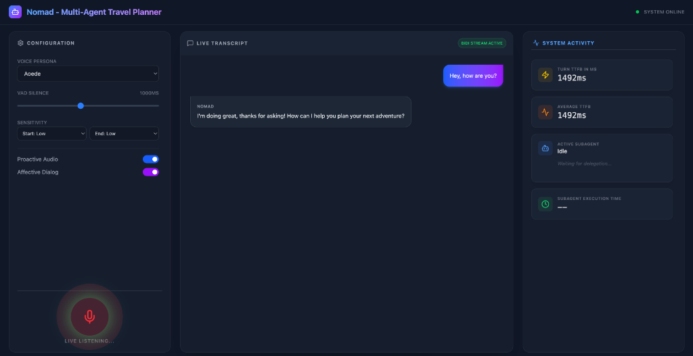
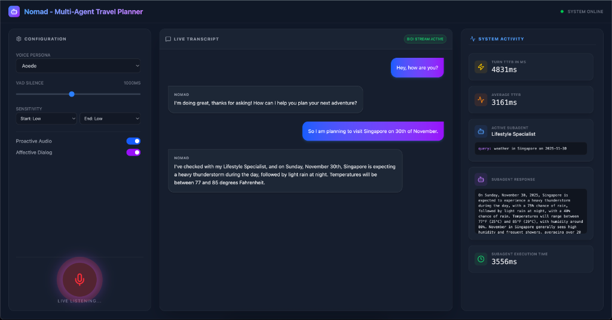

# Nomad: The Dreamstream Planner

Nomad is a voice-first collaborative travel assistant built with the **Google Agent Development Kit (ADK)**. It demonstrates **bi-directional voice streaming** (low latency, interruption handling) and **multi-agent orchestration** using Gemini 2.5 Flash.




## Architecture

- **Backend**: Python (FastAPI) + Google ADK
  - **Orchestrator**: `NomadConcierge` (`gemini-live-2.5-flash-native-audio`) routes tasks.
  - **Subagents**: `Flight Specialist` and `Lifestyle Specialist` (both use `gemini-2.5-flash`).
- **Frontend**: React + Vite + WebSockets
  - Real-time audio visualization.
  - Live transcript and system activity dashboard.

## Setup

### Backend

```bash
cd backend
python -m venv .venv
source .venv/bin/activate
pip install -r requirements.txt
python app.py
```

_Server runs on http://0.0.0.0:8000_

### Frontend

```bash
cd frontend
npm install
npm run dev
```

_Client runs on http://localhost:5173_

## Configuration

Developers can customize the agent's behavior and models in `backend/config.py`:

- **Model Selection**: Change `ORCHESTRATOR_MODEL` or `SUBAGENT_MODEL` to test different Gemini versions.
- **System Instructions**: Modify `NOMAD_INSTRUCTION` to change the orchestrator's persona or `FLIGHT_SPECIALIST_INSTRUCTION` / `LIFESTYLE_SPECIALIST_INSTRUCTION` to tweak subagent behavior.
- **App Name**: Update `APP_NAME` for session tracking.

## Metrics & Observability

The application provides real-time visibility into system performance and agent reasoning:

### 1. Latency Metrics

- **Turn TTFB (Time to First Byte)**: The time from when the user stops speaking (VAD detected) to when the first byte of the agent's audio response is received.
  - _Note_: This accounts for VAD silence duration to give a true "end-of-speech" to "start-of-response" measurement.
- **Subagent Execution Time**: The specific duration taken by a subagent tool (e.g., `consult_flight_specialist`) to process and return a result.

### 2. Activity Dashboard

The right-hand panel in the frontend visualizes the agent's "brain":

- **Active Subagent**: Shows which specialist is currently working (e.g., "Flight Specialist").
- **Subagent Args**: Displays the parameters passed to the tool (e.g., `{"destination": "Tokyo", "date": "May 2025"}`).
- **Subagent Response**: Shows the raw JSON/Text output from the subagent.

## Conversation Examples

### Standard Interaction (Direct Response)

_Low latency, handled directly by the Orchestrator._

> **User**: "Who are you?"
> **Nomad**: "I'm Nomad, your collaborative travel assistant! I work with a team of specialists to help you plan trips."


### Subagent Interaction (Delegation)

_Higher latency, involves tool execution and multi-turn reasoning._

> **User**: "Find me flights to Tokyo for under $1000 in May."
> **Nomad**: _[Internal Thought: User needs flights -> Call Flight Specialist]_ > **System**: _[Visual: Active Subagent "Flight Specialist" appears]_ > **Flight Specialist**: _[Tool executes: Checks mock DB]_ -> Returns "ANA, $850, May 20th"
> **Nomad**: "I found a great option on ANA for $850 departing May 20th. Does that work for you?"

